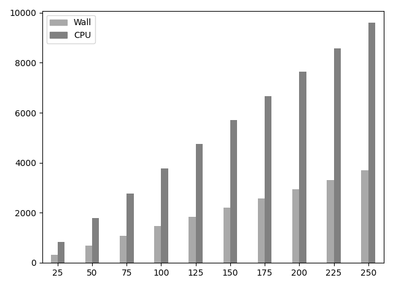
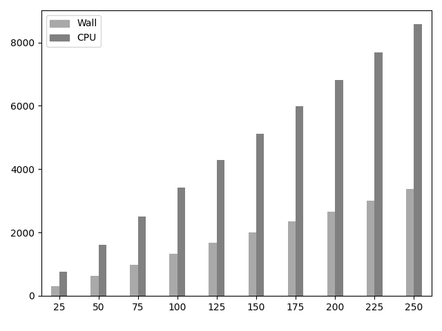
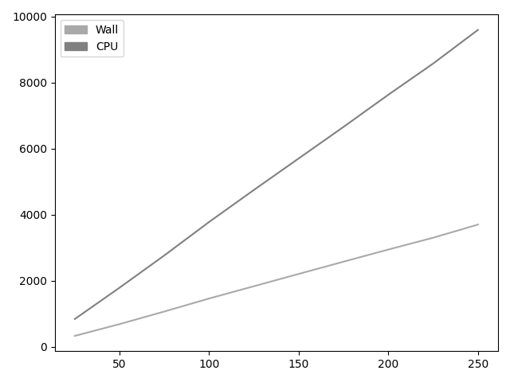
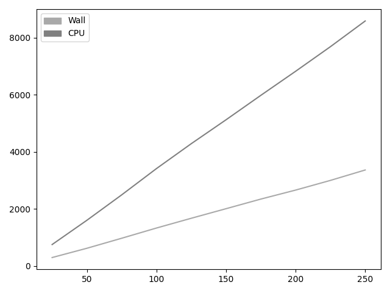

# Performance Test Results

## Background

Here are results displayed from running the Percolator C++ source code and measuring the run-time it took for the program to finish. Measurements do not include the time it took to load input-data.

Measurements was done by running the python script "SystemTest_Percolator_Speed.py". This script starts a child-process, which in this case is the Percolator executable and also pass on relevant inputs and flags. Then it captures the output which includes the run-time by re-directing pipes from stdout and stderr.

It's necessary to evaluate the performance before deciding on making changes to the source code. The tests here include checking the speed of running Percolator unmodified, using the Quick-LOHify algorithm or replacing some parts of the code that use std::sort with the parallelized version __gnu_parallel::sort (note that in C++17 and C++20 parallelization is more or less automatically implemented for std::sort).

## Tests

The most interesting data retrieved from tests were the minimum and average run-time it took to run Percolator. Most tests were repeted 10 or 5 times. The input data contained 25 million lines of PSMs. Percolator was compiled using C++14, and the time it took reading the input from disk was not accounted for.

All tests was conducted on a stationary computer running Ubuntu 18.04.5 LTS with the following hardware:
- 32 GB of RAM (clocked at 1333Mhz)
- Intel(R) Core(TM) i7-4790K CPU @ 4.00GHz
- Seagate 10 TB HDD

## Results

The raw data for the results can be seen [here](https://github.com/statisticalbiotechnology/and/tree/master/raw_data). The tests showed a minor speed-up when implementing Quick-LOHify in CrossValidation::mergeCpCnPairs(...), as it was done by Oliver Serang et al. A 5.5 minute speed-up was achieved for what normally takes about 1 hour. In other words, Quick-LOHify could make Percolator up to 10% faster.

Making sure std::sort was parallelized via __gnu_parallel also showed a small improvement in speed, but not large enough perhaps to justify changing the source code. The reason for why not a greater imrovement was seen is probably that some code already is running in parallel through OpenMP. The tables below show the recorded times in wall clock and CPU clock second format.

| Wall clock  | Min  | Mean | Max|
| :------------ |:---------------|:-----|:-----|
| Original       | 3694 | 3712 |   3734    |
| Original (__gnu_parallel)  | 3684  |    3698.2 |   3706    |
| QLOH (mergeCpCnPairs)       | 3348        |   3382.5 |   3534    |
| QLOH (mergeCpCnPairs & __gnu_parallel)       | 3349        |   3364.5 |   3375    |
| QLOH (train & doStep)  | 4696  |    4712.8 |   4723    |

 

| CPU clock  | Min  | Mean | Max|
| :------------ |:---------------|:-----|:-----|
| Original       | 9580 | 9623.8 |   9682    |
| Original (__gnu_parallel)  | 9546.058  |    9589.076 |   9620.572    |
| QLOH (mergeCpCnPairs)       | 8546        |   8641.3 |   9021    |
| QLOH (mergeCpCnPairs & __gnu_parallel)       | 8584.805        |   8611.183 |   8640.103    |
| QLOH (train & doStep)  | 12560.031  | 12614.118 |   12662.532    |

 

## Graphs

In this section graphs are displayed that show how the run-times increase linearly with the input size. The horizontal line shows the input size in terms of millions of lines with PSMs. The vertical line shows the number of wall clock or CPU clock seconds.

The graphs only show the minimum run-times achieved and could have other results for average or maximum run-times.

Whilst the vertical bars admittedly are a bit confusing due to having varying step sizes, they indicate that the original version of Percolator is slower than when Quick-LOHify is implemented. When the input size gets larger, both algorithms run-time increase linearly and therefore Quick-LOHify will always be faster for any input.

|     |
| :--: | 
| *Original Percolator to the left and Quick-LOHify to the right.* |

|     |
| :--: | 
| *Original Percolator to the left and Quick-LOHify to the right.* |
