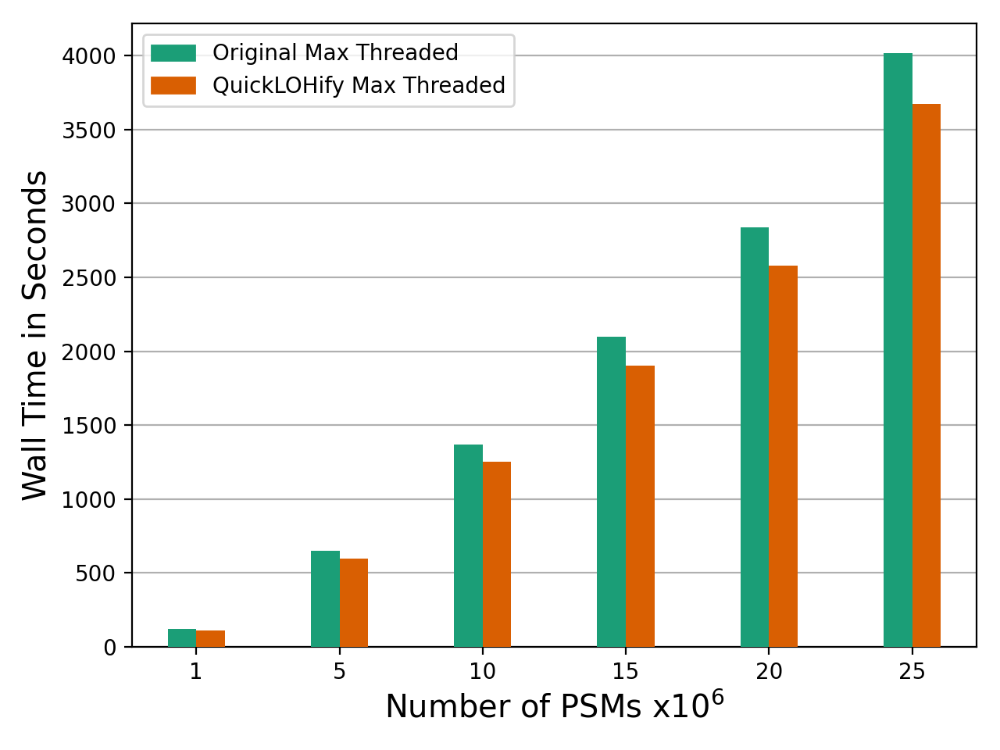
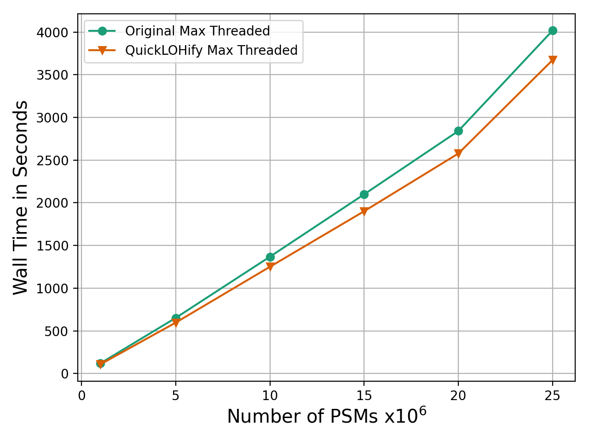
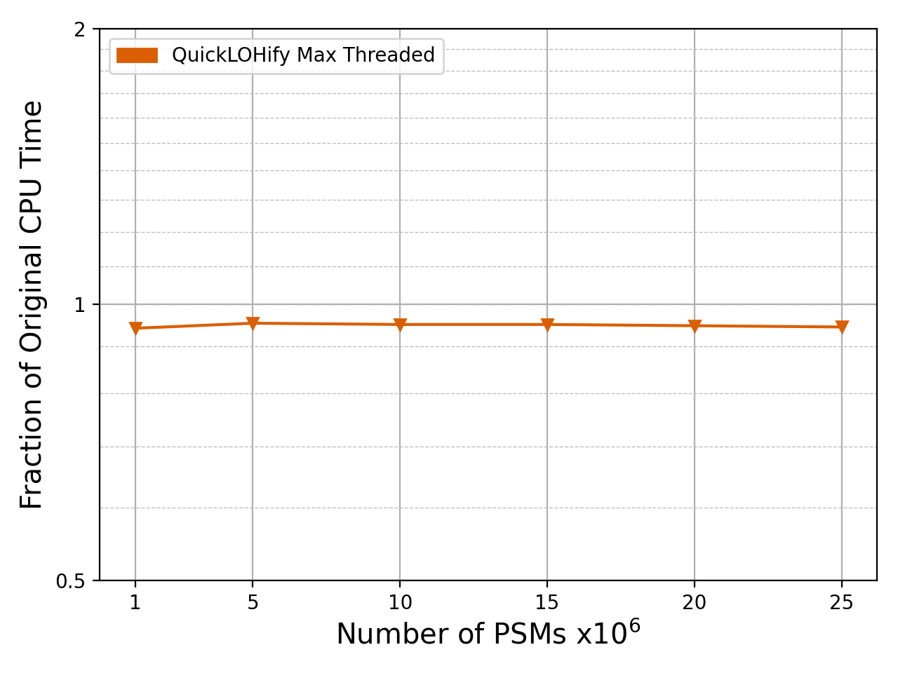
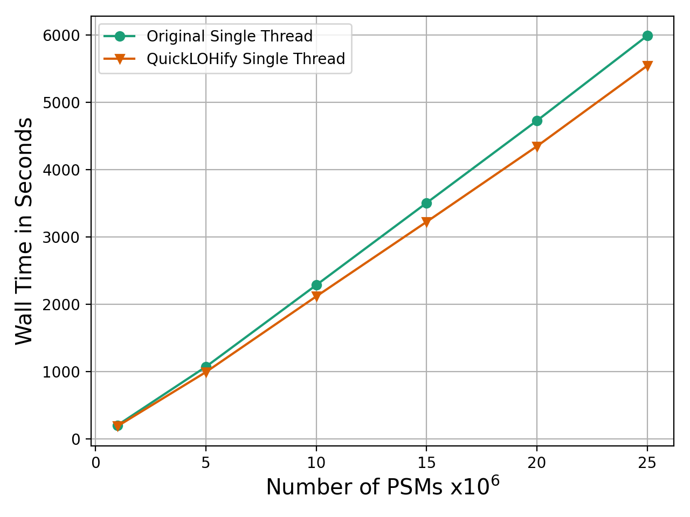

# Performance Test Results

## Background

Here are results displayed from running the Percolator C++ source code and measuring the run-time it took for the program to finish. Measurements do not include the time it took to load input-data.

Measurements was done by running the python script "SystemTest_Percolator_Speed.py". This script starts a child-process, which in this case is the Percolator executable and also pass on relevant inputs and flags. Then it captures the output which includes the run-time by re-directing pipes from stdout and stderr.

It's necessary to evaluate the performance before deciding on making changes to the source code. The tests here include checking the speed of running Percolator unmodified, using the Quick-LOHify algorithm or replacing some parts of the code that use std::sort with the parallelized version __gnu_parallel::sort (note that in C++17 and C++20 parallelization is more or less automatically implemented for std::sort).

## Tests

The most interesting data retrieved from tests were the minimum and average run-time it took to run Percolator. Most tests were repeted 10 or 5 times. The input data contained 25 million lines of PSMs. Percolator was compiled using C++14. The time it took reading the input from disk was not accounted for.

All tests was conducted on a stationary computer running Ubuntu 18.04.5 LTS with the following hardware:
- 32 GB of RAM (clocked at 1333Mhz)
- Intel(R) Core(TM) i7-4790K CPU @ 4.00GHz
- Seagate 10 TB HDD

## Results

The raw data for the results can be seen [here](https://github.com/statisticalbiotechnology/and/tree/master/raw_data). The tests showed a minor speed-up when implementing Quick-LOHify in CrossValidation::mergeCpCnPairs(...), as it was done by Oliver Serang et al. A 5.5 minute speed-up was achieved for what normally takes about 1 hour. In other words, Quick-LOHify could make Percolator up to 10% faster.

Making sure std::sort was parallelized via __gnu_parallel also showed a small improvement in speed, but not large enough perhaps to justify changing the source code. The reason for why not a greater imrovement was seen is probably that some code already is running in parallel through OpenMP. The tables below show the recorded times in wall clock and CPU clock second format. One possible reason as for why no speed-up was seen could have been because of the fact that the code sets the number of threads via `omp_set_num_threads(int)` to 3 by default.

The functions mergeCpCnPairs and doStep are in the class named CrossValidation. When QLOH was applied in mergeCpCnPairs it wasn't used for calculating the variable "bestTruePos", but only the amount of true positives, "tp". One possible reason as to why QLOH makes Percolator slower when applied everywhere, instead in just having it in mergeCpCnPairs, might be because of how it was implemented in the code. In these tests a lot of allocations and de-allocations were done which probably aren't truly necessary. Specifically, QLOH creates a new array of pairs "score_label_pairs" and de-allocates it each time the function is called.

| Wall clock  | Min  | Mean | Max|
| :------------ |:---------------|:-----|:-----|
| Original       | 3694 | 3712 |   3734    |
| Original (__gnu_parallel)  | 3684  |    3698.2 |   3706    |
| QLOH (mergeCpCnPairs)       | 3348        |   3382.5 |   3534    |
| QLOH (mergeCpCnPairs & __gnu_parallel)       | 3349        |   3364.5 |   3375    |
| QLOH (doStep)  | 4696  |    4712.8 |   4723    |

 

| CPU clock  | Min  | Mean | Max|
| :------------ |:---------------|:-----|:-----|
| Original       | 9580 | 9623.8 |   9682    |
| Original (__gnu_parallel)  | 9546.058  |    9589.076 |   9620.572    |
| QLOH (mergeCpCnPairs)       | 8546        |   8641.3 |   9021    |
| QLOH (mergeCpCnPairs & __gnu_parallel)       | 8584.805        |   8611.183 |   8640.103    |
| QLOH (doStep)  | 12560.031  | 12614.118 |   12662.532    |

 

## Graphs

In this section graphs are displayed that show how the run-times increase linearly with the input size. The horizontal line shows the input size in terms of millions of lines with PSMs. The vertical line shows the number of wall clock or CPU clock seconds.

The graphs only show the minimum run-times achieved and could have other results for average or maximum run-times.

The vertical bars indicate that the original version of Percolator is slower than when Quick-LOHify is implemented. When the input size gets larger, both algorithms run-time increase similarly and therefore Quick-LOHify will always be faster for any input.

The number of threads here specify how many OpenMP threads that are set. In these tests the program may always use multiple threads for parts of the code that are not managed by OpenMP. Max threads means that OpenMP gets to decide itself, dynamically, how many threads that should be utilized. The optimal amount of threads is usually system-dependent.

|     |
| :--: | 
| *CPU clock time to the left and wall clock time to the right.* |

|     |
| :--: | 
| *CPU clock time to the left and wall clock time to the right.* |

|     |
| :--: | 
| *CPU clock time to the left and wall clock time to the right.* |

Percolator run with a single OpenMP thread is shown below.

|     |
| :--: | 
| *CPU clock time to the left and wall clock time to the right.* |

|     |
| :--: | 
| *CPU clock time to the left and wall clock time to the right.* |

|     |
| :--: | 
| *CPU clock time to the left and wall clock time to the right.* |

### Large Input Data

It was of interest to see how much QLOH possibly could affect Percolator. QLOH was intended to be used in the function *CrossValidation::mergeCpCnPairs*. Therefore, a profiling tool called Perf was used with Percolator with different input data sizes to find out how much this time mergeCpCnPairs took up in the program relative to the other parts. Below are some FlameGraphs that estimate how much time the function took up in percentage. The profiling was done via statistical sampling, with sampling rates between 90-99 samples per second. To make the FlameGraphs more clear, the flag --num-threads was set to 1, meaning that only 1 thread should be used by the software. In the test using the Wilhelm et. al dataset, the sampling rate was reduced to 90 samples per second. For the other tests the sampling rate were between 97-99 samples per second.

The tests with large input data (100 million or more PSMs) were made on a cluster (https://www.hpc2n.umu.se/) due to the program requiring a lot of RAM. These graphs generally looks abnormal, however the function of interest, mergeCpCnPairs, is still visible.

|  |
| :--: |
| Test with 25 million PSMs. |

|  |
| :--: |
| Test with 100 million PSMs. |

|  |
| :--: |
| Test with a little more than 215 million PSMs. (Wilhelm et. al dataset) |

What can be concluded from the tests is that the time spent in mergeCpCnPairs shrink as the input size increases. Thus, even if you reduce the runtime of that function to 0 %, the total runtime for the program would not be reduced more than approximately 20 %.

## FDR Calculation

How FDR Calculations change in speed when some calculations are replaced by Quick-LOHify is presented in this section. Tests were made with 1,119,345 and 25,000,000 PSM:s as input respectively. The tests with 1,119,345 PSM:s were done on a system using the CPU model i7-10510U, the tests with 25,000,000 PSM:s on a system with i7-4790K. Both CPU:s have 8 threads.

The tables below show the average runtime for a single FDR-calculation. FDR-calculations are done in 10 iterations in a standard utlization of the Percolator software. The numbers below were calculated by running Percolator 10 times, or in other words running 100 individual FDR-calculations and retrieving the average time in wall clock seconds.

For 1,119,345 PSM:s the tests showed that FDR calculations are performed 36 % faster on a single thread and 44 % faster with 8 threads when using Quick-LOHify.

| (1,119,345 PSM:s) | Original | QLOH |
| :------------ |:---------------| :---- |
|1 Thread| 5.45261 | 3.46485 |
|8 Threads| 2.4223 | 1.34552 |

For 25,000,000 PSM:s the tests showed that FDR calculations are performed 33 % faster on a single thread.

| (25,000,000 PSM:s) | Original | QLOH |
| :------------ |:---------------| :---- |
|1 Thread| 136.7136 | 91.44519 |
|8 Threads| ... | ... |
